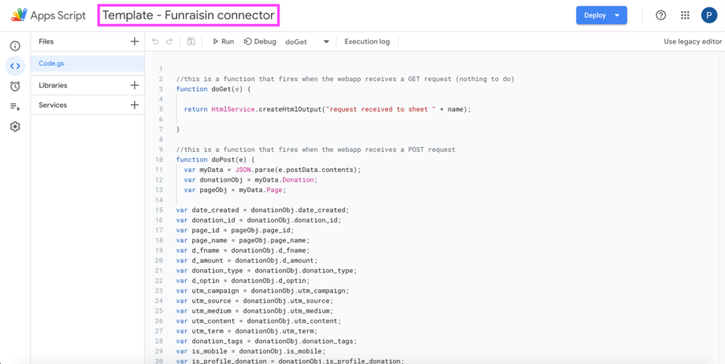
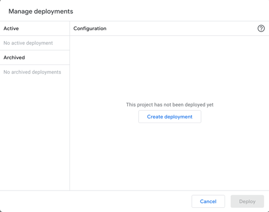
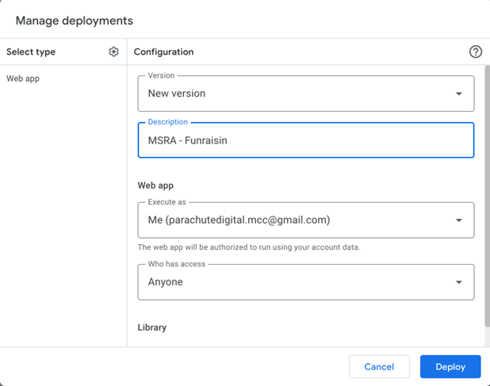
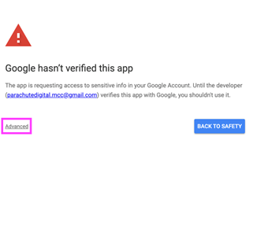
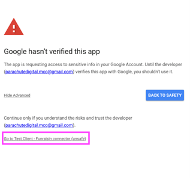
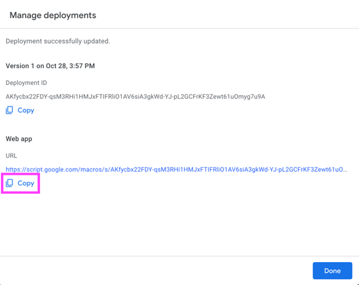
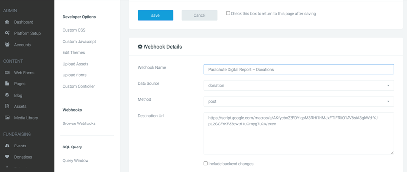
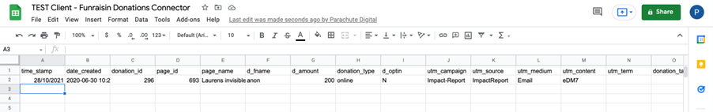

# Connect Funraisin Donations with Google Sheets

> This needs to be done once per client (actually it’s once per Funraisin instance, but most often clients only have one instance... the important thing is that it is **NOT** once per campaign ).

After you finish these steps, ALL new donations will end up on the Google Sheets that you can then use in your DataStudio report, so remember to use filters if necessary to count only the donations you’re interested in (page_id might be the best option to use for filtering if required).

---

## Steps

1. Be logged in as parachutedigital.mcc@gmail.com
2. Duplicate this [template](https://docs.google.com/spreadsheets/d/16aVxSeJIIjkG2-T8ZEANQL5ajMy9CWIDLjQWmkxKNEo/edit?usp=sharing) (File -> Make a copy) 
3. Save it the CLIENT folder on Google Drive, under Reports (again, NOT in the campaign folder - create the folder if required)
4. Rename as "\<Client\> \- Funraisin Donations Connector", where \<Client\> is the name of the client, like "MSRA","CSW", etc
5. Open the Scripts Editor (Extensions -> App Script) and rename it also as "\<Client\> \- Funraisin Donations Connector". To rename it click in area marked as **pink** in the screenshot:

6. Go to Deploy -> Manage deploy. You should see the screen below (with the message "This project has not been deployed yet"), if you see anything different please do **NOT** continue as something went wrong when duplicating the template.

7. Click on "Create deployment" and you will be prompted with the screen below. In description enter "\<Client\> - Funraisin" and make sure the others fields are like in the screenshot below. If they are, click **DEPLOY** and then **Authorize** access.
8. Choose parachutedigital.mcc@gmail.com account
9. After this you will see a warning saying that Google hasn’t verified this app. That’s not a problem as we ourselves are the developers of the web app, so click in the small link "Advance" and then the other link "Go to \<Client\> - Funraisin connector (unsafe)"  
10. Click **Allow** on the next window 
11. You should now be back at the Script Editor screen and you should see the screen below (if you still see the "Authorize access" button, click it again and repeat the process). **COPY** the web app URL and click **DONE**
12. Go to Funraisin
13. Go to Developer -> Browse Webhooks and click "New Webhook". Give it a name like "Parachute Digital Report – Donations" and in destination URL paste the URL you copied on the previous step and click **SAVE**
14. After that click on the pencil icon to edit your newly created Webhook and scroll down. 
15. You will see a button "Test Webhook". Click it and go back to the Google Sheet you created earlier. 
16. If you see some dummy data, congrats! It’s working!
17. **DELETE THE DUMMY DATA**
18. Pat yourself on the back.

New donations will be added to that Google Sheets as they are created. Now you can use that Google Sheet on your Data Studio reports. This will work from the moment you activate it, so If the campaign is already ongoing, you will need to manually export the donations until that moment and add them to the Google Sheets following the same fields/format.

> If there are any issues, please refer to Marcos or Steve